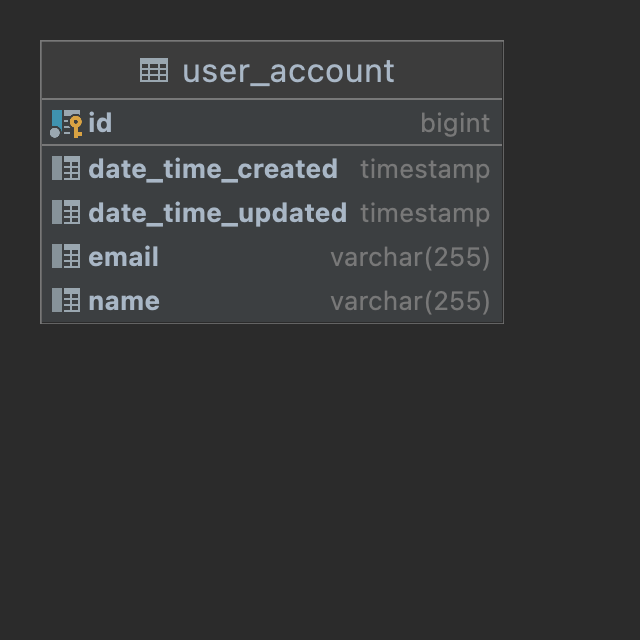
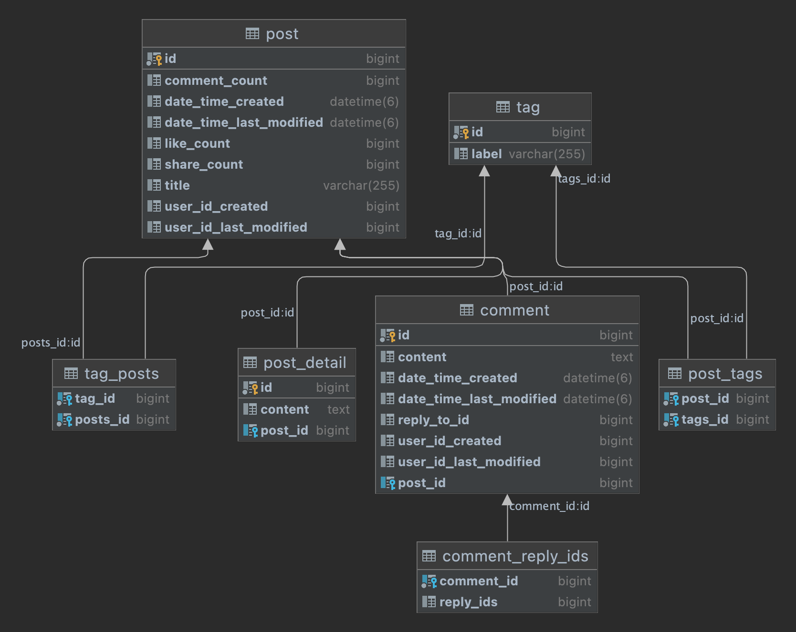

# mysite-services

Backend services for my conceived personal website.

Available services

- user-account: provides basic CRUD operations for user account management.
  - Database: MySQL 
- blog-post: provides basic CRUD operations for blog post management.
  - PostgreSQL

## user-account

## blog-post

